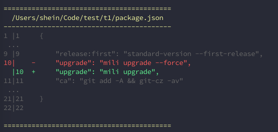

<p align="center" style="padding-top: 40px">
  
</p>

<h1 align="center" style="text-align: center">Mili</h1>

[](https://www.npmjs.com/package/mili)
[](https://www.npmjs.com/package/mili)
[](https://www.npmjs.com/package/mili)

> 米粒之光，可与皓月争辉

**从同一个脚手架衍生出来的项目，很多细节会渐渐变得不一致**
也就是说：脚手架对于项目的后续发展失去了控制力。
当我们想要升级一些脚手架的基础功能（例：eslint规则）时，我们不得不去升级每一个项目.
甚至不得不对一些改动过大的项目设计定制化的升级方案。

因此，为了提高脚手架对项目后续发展的控制力，模版可以修改一部分文件，并发布新的模版版本。然后，项目就可以升级模版版本。

如果你们团队管理着多个项目，并希望这些项目具有统一的、可持续迭代的代码规范、基础功能、框架结构，mili非常适合作为你们的脚手架工具。

## Usage

Mili的核心设计理念：

<p align="center">
  
</p>

1. 首先，你需要开发一个模版（template），或者使用别人的模版。
2. 创建项目目录，并在项目根目录运行`npx mili init template_path`。
3. 当模版版本需要升级时，在项目根目录运行`npx mili upgrade`
4. 模版中会对各个文件配置各种的handler，`mili`会在初始化和升级时调用对应的`handler`生产项目文件。

### 创建项目

我们使用[mili-template](https://github.com/Val-istar-Guo/mili-template)模版来创建一个项目：

```shell
// template in github
npx mili init github:Val-istar-Guo/mili-template.git
// template in npm
npx mili init npm:mili-template
// template in private git repository
npx mili init https://github.com/Val-istar-Guo/mili.git
```

### 升级项目

升级操作非常简单，模版配置文件中对于每个文件配置的handlers, 决定了升级操作的对项目文件的影响。

```shell
# 在项目目录下执行
mili upgrade
```

handler可以提取项目文件的数据，或者将模板文件用为[mustache](https://github.com/janl/mustache.js)模板，并将项目数据作为view，渲染出新的项目文件，并覆盖旧文件。

handlers可以自由灵活地组合，以实现各种各样的`init`和`upgrade`运行效果。

### 校验项目文件

配合[husky](https://www.npmjs.com/package/husky)，可以很容易的实现提交前校验项目文件是否符合模版规范。
从而保障项目代码的规范。

在终端运行命令：
```shell
npx mili check
```

或者在[husky](https://www.npmjs.com/package/husky)里配置：
```yaml
hooks:
  pre-commit: 'npx mili check --diff --fold'
```

An example:



运行`npx mili update`命令，mili将自动按照`diff`的提示进行增删，从而符合模版的规范。

## 正反馈

### 模版 => 项目

模版的更新都会按照设定的文件升级方案应用到每个使用这个模版的项目中去，减轻每个项目进行升级的工作量。

### 项目 => 模版

当存在一下情况时：

1. 被模版的基础功能/结构无法满足项目的业务需求
2. 模版的文件存在bug

这时候，项目的开发者需要对模版进行更新。因为只有更新到模版后，才能‘安全的’将这些改动应用到项目中来（通过升级模版）。
与此同时，模版 => 项目的反馈也会为所有的项目带来bug升级、新特性、或结构性调整，减少其他项目升级工作量。

## Q&A

### template的模版非常像是一个依赖包，为什么不将模版提成一个npm包呢？

1. 其实，模版的一部分功能确实应该抽象成一个库，将打包、发布、公司内部服务甚至server等全部按照统一规范包装成一个库（npm包）。

   但是，这只是理想状况。通常来说，团队始于一个模版，一个项目，逐步发展到多个项目。
   经过很长一段时间，总结经验，最终才会形成一个规范的库。
   而在这段时间内，将会面临每个项目中实现细节分化的问题。

   最终，在将有一致规范的功能抽象为库的过程中，需要大量改造项目，带来很大的项目改造开发量。

   mili可以在这个过程中起到缓冲作用和辅助升级作用，保证所有项目具有一致的模版。

2. 有些文件无法抽象到库中，但是还需要在所有项目里统一。例如：issue模版、readme.md的内容结构等东西。
   必须要放在项目根目录下才能被识别，但是又需要跟随模版升级、多项目统一。

因此，即使已经将具有统一规范的功能完全的抽象为一个库，依旧有很大的可能，在每个项目下面，存在一些需要多项目统一的文件。

另外，必须要说明的一点是**将具有统一规范的部分提取成库与mili并不冲突**。往往你提取完成后，得到的依旧是一个简化的轻量级的模版。

## 更多内容

- [CLI API](./cli.md)
- [NODE API](./node-interface.md)
- [模版开发](./template.md)
- [Handler](./handler/index.md)
- 示例：
  + [mili-template](https://github.com/Val-istar-Guo/mili-template): 一个简单的mili模版，很适合作为第一次开发模版的参考项目。

## Contributing & Development

如果存在如何疑问，非常欢迎提issue一起讨论。
请在讨论时，遵守[Contributor Covenant Code of Conduct](../../.github/CODE_OF_CONDUCT.md)与[CONTRIBUTING](../../.github/CONTRIBUTING.md)。
让我们共同维护良好的社区环境。
